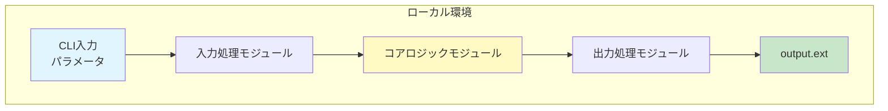
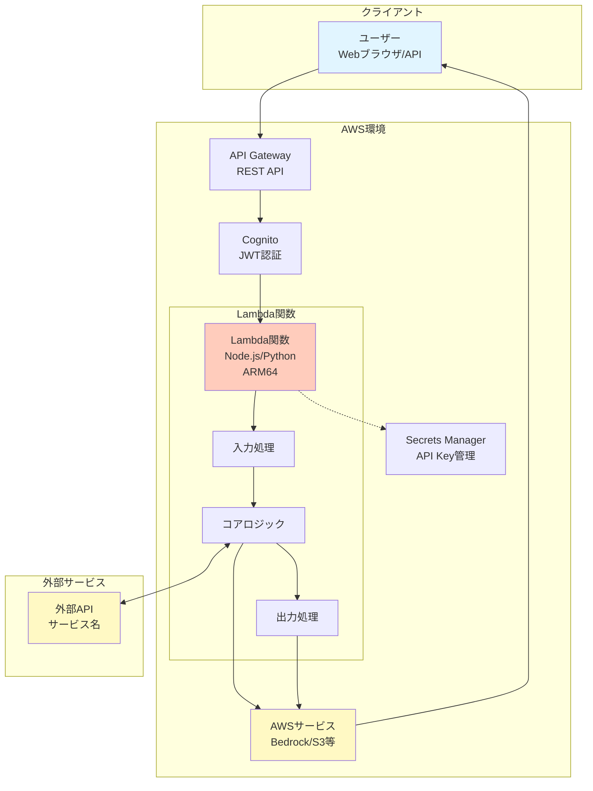

# System Design Document Generator

複数の技術調査・分析レポートを統合し、統一的で包括的なシステム設計書を自動生成するスキルです。

## 📋 スキル概要

このスキルは、散在する技術調査レポート、分析結果、アーキテクチャメモなどを統合し、以下の要素を含む体系的なシステム設計書を生成します：

- **Mermaid構成図**: 視覚的なシステムアーキテクチャ
- **モジュール設計**: TypeScriptインターフェース定義
- **技術選定比較表**: 評価軸と根拠
- **API設計書**: エンドポイント仕様
- **実装フェーズ計画**: MVP〜本番運用までのロードマップ
- **非機能要件**: パフォーマンス、セキュリティ、コスト要件

## 🎯 使用タイミング

以下の状況でこのスキルを使用してください：

1. **技術調査完了後**: 複数の技術調査レポートが揃った時
2. **アーキテクチャ設計時**: システム全体の設計をまとめる時
3. **開発開始前**: 実装前に設計ドキュメントを整備する時
4. **ステークホルダー説明用**: 技術的意思決定の根拠を文書化する時
5. **プロジェクトハンドオフ時**: 設計情報を後続チームに引き継ぐ時

## 📥 入力要件

### 必須入力

1. **分析レポート（複数可）**
   - 技術調査レポート（例: `pptx-tech-research.md`）
   - コード構造分析レポート（例: `marp-agent-analysis.md`）
   - パフォーマンスベンチマーク結果
   - セキュリティ評価レポート

2. **プロジェクト情報**
   - プロジェクト名
   - バージョン番号
   - 主要機能の概要
   - 技術スタック

### オプション入力

- 既存の設計メモ・ラフスケッチ
- ステークホルダー要件定義書
- 競合分析資料
- コスト制約・予算情報

## 📤 出力形式

### システム設計書の構造

```markdown
# {プロジェクト名} システム設計書

**バージョン**: x.x.x
**作成日**: YYYY-MM-DD
**作成者**: {作成者名}
**承認者**: {承認者名}

---

## 📋 目次

1. システム概要
2. システム構成図
3. モジュール設計
4. API設計
5. 技術選定の根拠
6. 実装フェーズ分け
7. 非機能要件
8. 参考資料

---

## システム概要

### プロジェクト目的
{目的の記述}

### 主要機能
{機能リスト}

### コアバリュー
{価値提案}

---

## システム構成図

### {環境名}アーキテクチャ

\`\`\`mermaid
{Mermaid図}
\`\`\`

**処理フロー**:
{フローの説明}

---

## モジュール設計

### {モジュール名}

**責務**: {役割の説明}

\`\`\`typescript
interface {InterfaceName} {
  // メソッド定義
}
\`\`\`

**実装方針**:
{実装の詳細}

---

## API設計

### エンドポイント: \`{METHOD} {PATH}\`

**リクエスト**:
\`\`\`json
{リクエスト例}
\`\`\`

**レスポンス**:
\`\`\`json
{レスポンス例}
\`\`\`

---

## 技術選定の根拠

### {技術名}: **{選定ライブラリ}** ✅

#### 選定理由

| 評価軸 | ライブラリA | ライブラリB | ライブラリC |
|--------|-------------|-------------|-------------|
| 評価項目1 | ✅ | ⚠️ | ❌ |
| 評価項目2 | ✅ | ✅ | ⚠️ |

#### 決定的な優位性
{理由の詳細}

---

## 実装フェーズ分け

### Phase 1: MVP（最小機能版）

**目標**: {Phase 1の目標}
**期間**: {期間}
**実装範囲**: {スコープ}

### Phase 2: 機能拡張

**目標**: {Phase 2の目標}
**期間**: {期間}
**実装範囲**: {スコープ}

### Phase 3: 本番対応

**目標**: {Phase 3の目標}
**期間**: {期間}
**実装範囲**: {スコープ}

---

## 非機能要件

### パフォーマンス要件

| 指標 | 目標値 | 測定方法 |
|------|--------|----------|
| {指標名} | {目標値} | {測定方法} |

### 可用性要件

| 指標 | 目標値 | 対策 |
|------|--------|------|
| SLA | {目標値} | {対策} |

### セキュリティ要件

| 項目 | 対策 |
|------|------|
| 認証 | {対策} |
| 認可 | {対策} |

### コスト要件

**想定利用量**: {利用量}

| サービス | 使用量 | 月額概算 |
|---------|--------|---------|
| {サービス名} | {使用量} | {金額} |

---

## 参考資料

### 分析レポート
{参照した分析レポートのリスト}

### 技術ドキュメント
{公式ドキュメント等のリンク}

---

## 変更履歴

| バージョン | 日付 | 変更内容 | 承認者 |
|-----------|------|----------|--------|
| 1.0.0 | YYYY-MM-DD | 初版作成 | {承認者名} |
```

## 🛠️ 実装パターン

### 1. Mermaid構成図テンプレート

#### ローカル版アーキテクチャ



#### サーバーレス版アーキテクチャ



### 2. モジュール設計のTypeScriptインターフェース定義パターン

#### 入力処理モジュール

```typescript
interface InputProcessor {
  // CLI入力の解析
  parseCLIArgs(args: string[]): InputParams;

  // API入力の検証
  validateAPIInput(body: RequestBody): ValidationResult;

  // 入力パラメータの正規化
  normalize(input: RawInput): InputParams;
}

interface InputParams {
  // 必須パラメータ
  requiredParam: string;

  // オプショナルパラメータ
  optionalParam?: string;

  // デフォルト値付き
  withDefault: string;  // デフォルト: "value"

  // 列挙型
  mode: 'option1' | 'option2' | 'option3';
}

interface ValidationResult {
  isValid: boolean;
  errors?: ValidationError[];
}

interface ValidationError {
  field: string;
  message: string;
  constraint: string;
}
```

#### コアロジックモジュール

```typescript
interface CoreModule {
  // メイン処理
  process(input: InputParams): Promise<ProcessResult>;

  // ストリーミング対応（AWS版）
  processStream(input: InputParams): AsyncGenerator<ProcessEvent>;
}

interface ProcessResult {
  success: boolean;
  data?: OutputData;
  error?: ProcessError;
}

interface ProcessEvent {
  type: 'progress' | 'data' | 'complete' | 'error';
  payload: unknown;
}
```

#### 外部サービス連携モジュール

```typescript
interface ExternalServiceModule {
  // API呼び出し
  call(query: Query, options?: CallOptions): Promise<ServiceResult>;

  // バッチ処理
  callMultiple(queries: Query[]): Promise<ServiceResult[]>;

  // 結果の要約
  summarize(results: ServiceResult[]): Summary;
}

interface CallOptions {
  maxRetries?: number;        // 最大リトライ回数
  timeout?: number;           // タイムアウト（ms）
  fallback?: boolean;         // フォールバック有効化
}

interface ServiceResult {
  success: boolean;
  data?: unknown;
  error?: string;
  metadata?: {
    latency: number;
    retries: number;
  };
}
```

#### 出力処理モジュール

```typescript
interface OutputProcessor {
  // ローカル保存
  saveLocal(data: OutputData, filename: string): Promise<string>;

  // クラウドアップロード
  uploadToCloud(data: OutputData, bucket: string, key: string): Promise<UploadResult>;

  // 署名付きURL生成
  generateSignedUrl(bucket: string, key: string, expiresIn: number): string;
}

interface UploadResult {
  bucket: string;
  key: string;
  etag: string;
  signedUrl: string;
}
```

### 3. 技術選定比較表フォーマット

#### 比較表の構造

```markdown
### {技術カテゴリ}: **{選定ライブラリ}** ✅

#### 選定理由

| 評価軸 | {ライブラリA} | {ライブラリB} | {ライブラリC} | {ライブラリD} |
|--------|---------------|---------------|---------------|---------------|
| **マルチ環境対応** | ✅ Node/Lambda/Browser | ❌ Pythonのみ | ✅ Node/Lambda | ✅ Node/Lambda |
| **AWS Lambda最適** | ✅ ゼロ依存・軽量 | ⚠️ Layer必要 | ⚠️ 中程度 | ⚠️ メンテ停滞 |
| **TypeScript対応** | ✅ 完全サポート | ❌ N/A | ✅ サポート | ❌ 非対応 |
| **日本語対応** | ✅ CJK対応 | ✅ Unicode対応 | ✅ 継承 | ✅ Unicode対応 |
| **メンテナンス** | ✅ 活発 | ✅ 活発 | ✅ 活発 | ❌ 5年停滞 |
| **ドキュメント** | ✅ 充実 | ✅ 充実 | ⚠️ 標準 | ⚠️ 古い |
| **パッケージサイズ** | ✅ 小 | ⚠️ 中 | ⚠️ 中 | ⚠️ 中 |

#### 決定的な優位性

1. **{優位性1}**: {詳細説明}
2. **{優位性2}**: {詳細説明}
3. **{優位性3}**: {詳細説明}
4. **{優位性4}**: {詳細説明}
5. **{優位性5}**: {詳細説明}

#### 制限事項と対策

- **{制限事項1}**: {対策}
- **{制限事項2}**: {対策}
```

#### 評価記号の使い方

- `✅`: 優れている、完全サポート、推奨
- `⚠️`: 普通、部分的サポート、注意が必要
- `❌`: 劣っている、非サポート、非推奨

### 4. 非機能要件チェックリスト

#### パフォーマンス要件

```markdown
| 指標 | 目標値 | 測定方法 |
|------|--------|----------|
| レスポンス時間 | {X}秒以内 | {ツール名}で計測 |
| スループット | {X}req/sec | 負荷テスト |
| コールドスタート | {X}秒以内 | X-Ray分析 |
| 並行実行数 | {X}同時処理 | 実測値 |
```

#### 可用性要件

```markdown
| 指標 | 目標値 | 対策 |
|------|--------|------|
| SLA | 99.X%以上 | Multi-AZ、自動スケール |
| RPO（復旧時点目標） | {X}時間 | バックアップ戦略 |
| RTO（復旧時間目標） | {X}時間 | IaCで即座に再構築 |
```

#### セキュリティ要件

```markdown
| 項目 | 対策 |
|------|------|
| 認証 | {認証方式} |
| 認可 | {認可方式} |
| データ暗号化（転送時） | HTTPS（TLS 1.3） |
| データ暗号化（保管時） | {暗号化方式} |
| APIキー管理 | Secrets Manager、自動ローテーション |
| レート制限 | {X}req/min/user |
| 入力検証 | {バリデーション方式} |
| XSS対策 | 入力サニタイゼーション |
| ログマスキング | APIキー、個人情報のマスキング |
```

#### コスト要件

```markdown
**想定利用量**: {利用量の説明}

| サービス | 使用量 | 月額概算（USD） |
|---------|--------|----------------|
| Lambda（ARM64 {X}GB {Y}秒） | {Z}実行 | ${金額} |
| {サービス2} | {使用量} | ${金額} |
| {サービス3} | {使用量} | ${金額} |
| その他（{詳細}） | - | ${金額} |
| **合計** | - | **${合計金額}** |

**コスト削減施策**:
- {施策1} → ${削減額}削減
- {施策2}
- {施策3}
```

## 📚 使用例

### 例1: 新規プロジェクトの設計書生成

```markdown
**状況**: consul-slidemanプロジェクトの設計書を作成したい

**入力資料**:
- `shogun/output/marp-agent-analysis.md`: 参考実装の分析
- `shogun/output/pptx-tech-research.md`: PPTX生成ライブラリの比較

**スキル起動**:
/system-design-doc-generator を使用して、以下の情報から設計書を生成してください：

プロジェクト情報:
- プロジェクト名: consul-slideman
- バージョン: 1.0.0
- 主要機能: テーマ入力から自動でPowerPointスライドを生成

参考資料:
- shogun/output/marp-agent-analysis.md
- shogun/output/pptx-tech-research.md

**出力**: `docs/design/consul-slideman-design.md`
```

### 例2: 既存プロジェクトの設計書更新

```markdown
**状況**: 技術選定が変更されたため、設計書を更新したい

**入力資料**:
- 既存の設計書: `docs/design/system-design.md`
- 新しい技術調査: `research/new-tech-evaluation.md`

**スキル起動**:
/system-design-doc-generator を使用して、既存の設計書を更新してください。

変更点:
- データベースをPostgreSQLからDynamoDBに変更
- 技術選定の根拠セクションを更新
- 非機能要件（パフォーマンス）を再評価

**出力**: `docs/design/system-design-v2.md`
```

## 🔍 知識ベース

このスキルは以下の知識ベースファイルを参照します：

- **`knowledge/design-doc-template.md`**: 設計書の詳細テンプレート
- **`knowledge/mermaid-patterns.md`**: よく使うMermaid図のパターン集
- **`knowledge/module-interface-patterns.ts`**: モジュール設計のTypeScript型定義サンプル

## ⚙️ 実行時の注意事項

1. **分析レポートの品質**: 入力となる分析レポートが詳細であるほど、高品質な設計書が生成されます
2. **一貫性の保持**: 複数の分析レポートに矛盾がある場合、明示的に質問して確認してください
3. **技術スタックの統一**: 選定技術が複数ある場合、評価軸と優先順位を明確にしてください
4. **フェーズ分けの妥当性**: 実装フェーズは現実的な期間と依存関係を考慮してください
5. **コスト見積もりの精度**: AWS料金計算ツールを使用して、実際の料金を確認してください

## 🎯 品質保証

生成された設計書は以下の観点でレビューしてください：

- [ ] すべての主要機能がカバーされている
- [ ] システム構成図が理解しやすい
- [ ] モジュール設計がSingle Responsibility Principleに準拠
- [ ] API設計が一貫性を保っている
- [ ] 技術選定の根拠が明確で説得力がある
- [ ] 非機能要件が具体的な数値目標で定義されている
- [ ] 実装フェーズが現実的で達成可能
- [ ] 参考資料がすべて記載されている

## 📖 関連スキル

- **backend-patterns**: バックエンドアーキテクチャパターンの参照
- **frontend-patterns**: フロントエンドアーキテクチャパターンの参照
- **security-review**: セキュリティ要件の詳細化
- **aws**: AWS特有の設計パターンの適用
- **datadog**: 監視設計の追加

## 🔄 バージョン履歴

| バージョン | 日付 | 変更内容 |
|-----------|------|----------|
| 1.0.0 | 2026-01-29 | 初版作成 |
